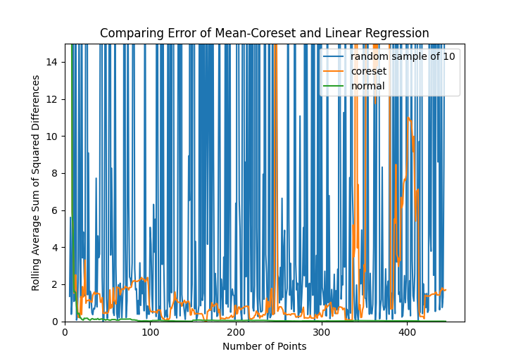
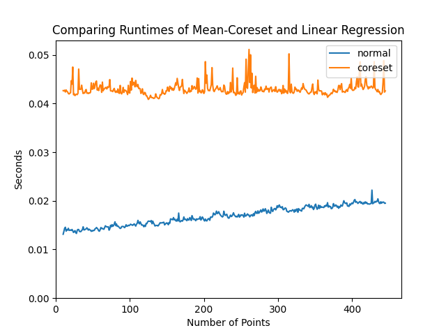

# Randomized and Big Data Algorithms Final Project

### Alexander Glavin and Conner Delahanty

> This repository has code and artifacts for our Randomized and Big Data Algorithms (601.434/634) 
> final project. In this, we implimented the Mean Coreset Algorithm proposed by Nasser et al. in 
> [Coresets for Kinematic Data: From Theories to Real-Time Systems](https://arxiv.org/pdf/1511.09120.pdf), 
> to optimize and perform and big-data linear regression. 

> Sample code, graphics, and more can be found on this page.

# Stabalization Results

### Full RANSAC

### Coreset Approach

### Random Point Approach

# Error of Mean-Coreset vs Linear Regression

# Run-time Comparison
  

Note normal RANSAC approach has dependence on n, and thus would be slower for pictures with ~O(2000) point correspondances. 
